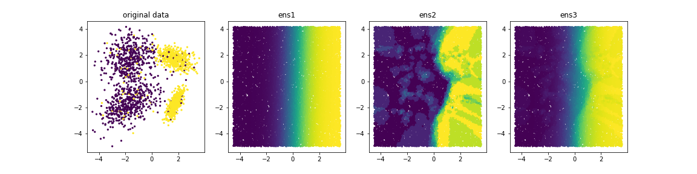

# 4 Meta Estimators

1. [Importar librerías y cargar los datos](#schema1)
2. [Generamos datos aleatorios](#schema2)
3. [VotingClassifier](#schema3)

# 1.  Importar librerías y cargar los datos

~~~python
import numpy as np
import matplotlib.pylab as plt
from sklearn.tree import DecisionTreeClassifier
from sklearn.linear_model import LogisticRegression
from sklearn.neighbors import KNeighborsClassifier
from sklearn.ensemble import VotingClassifier
from sklearn.datasets import make_classification
~~~

# 2.  Generamos datos aleatorios

~~~python
X, y = make_classification(n_samples=2000, n_features=2,
                           n_redundant=0, random_state=21,
                           class_sep=1.75, flip_y=0.1)
plt.scatter(X[:, 0], X[:, 1], c=y, s=5)
~~~

Podemos usar un `logistic regression` ya que se ven diferenciadas dos zonas de datos.

Podemos usar `KNeighborsClassifier` pero nos pueden dar muy malos resultados. 

Como se ve en la imágen si buscamos un valor en la zona redondeada hay mas vecinos lilas que amarillos y eso puede dar error.

# 3. VotingClassifier

~~~python
clf1 = LogisticRegression().fit(X, y)
clf2 = KNeighborsClassifier(n_neighbors=10).fit(X, y)
clf3 = VotingClassifier(estimators=[('clf1', clf1), ('clf2', clf2)],
                        voting='soft',
                        weights=[10.5, 2.5])
clf3.fit(X, y)
~~~

